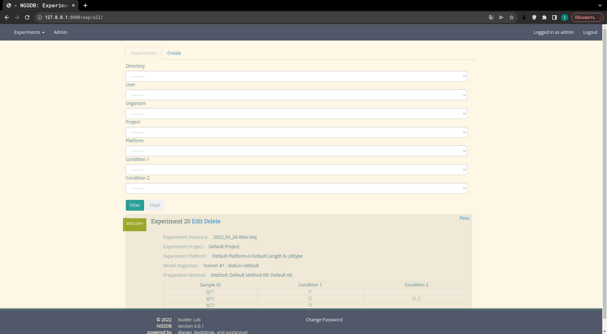
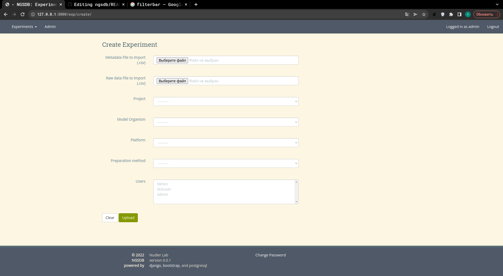

# Welcome to NGSDB - NGS experiments aggregator!

NGSDB is a web-based viewer that allows to aggregate, annotate and
organize metadata and results of high-throughput sequencing
experiments. It is geared towards a small to medium size research lab
rather than a large scale core facility.

Currently NGSDB handles bulk RNA-Seq experiments. The support for
ChIP-Seq experiments is planned for the future.

NGSDB organizes experiments by model organism (with custom attributes
such as genotype, strain, or cell line where appropriate), sequencing
platform (instrument, flow cell, read length), library preparation
kit, user and project.

The data can be either uploaded manually or ingested from a specified
location on the server running NGSDB.

Where available, NGSDB provides basic plotting functionality to
visualize results of basic RNA-Seq analysis such as PCA plot and
volcano plot for differential gene expression.

# Stack

1. Python 3.10
2. Postgresql
3. Django >= 4.0
4. django-filters
5. dash-bio
6. plotly

# Quick Start 
### 1. Preparation

   - Start your virtual enviroment and export your "SECRET_KEY" to variable `DJANGO_SECRET_KEY` (or manually add it to `ngsdb.settings.py`)

   - Create file `local_settings.py` if you want to change something locally (DATABASES dict f.e)

   - In `ngsdb.setting.py` change `NGS_LOCAL_FOLDER_FILEPATH` to whatever your local folder is using os module filepath system

### 2. Migrations 

Once you have updated all of your local credentials, you should migrate the database

   - run `python manage.py migrate` in your shell

### 3. Run the server 

   - run `python manage.py runserver` in your shell

### 4. Aditional 

   - There are some custom shell commands written in `exp.management.commands` folder. You can call one with `python manage.py 'filename'` (`python manage.py createusers` f.e)
 

# Overview & tutorial

   
   
### As a NGSDB user you can:
   1. Browse & filter created experiments using filterbar 
      - Browse the data using plots dropdown (top right corner of each experiment card)
      - Browse individual conditions of each experiment (Table)
      - Edit experiment metadata (edit link)
   2. Create your own experiments 
      
      - MetaData file: .csv file containing `Sample`, `Condition`, `Condition2`[Optional] columns 
      - RawData file: deseq.csv file containg `log2FoldChange`, `pvalue` columns
      - Project: Experiment Project 
      - Platorm: Experiment Platform
      - Users: Experiment Users
   

